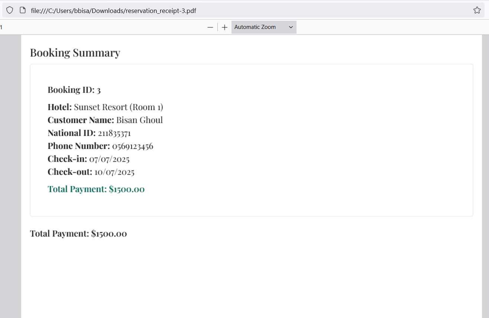

# Innsight Accommodation Booking Platform

An accommodation web application for booking hotel rooms, managing reservations, and exploring destinations. Built with React, TypeScript, Material UI, and a Node.js/Express backend.

---

## Tech Stack

**Frontend:**
- React (with TypeScript)
- Material UI (MUI)
- React Query (for server state and caching)
- React Router
- Formik & Yup (form management and validation)
- Day.js (date handling)
- jsPDF & html2canvas (PDF generation)

**Backend:**
- Node.js
- Express
- CORS, Morgan (middleware)
- Swagger (API documentation)
- File-based JSON storage (for hotels, rooms, bookings, etc.)

---

## Features

- **Hotel Search & Details**: Users can browse hotels, browse rooms inside hotels, view details, amenities, and image galleries for rooms.
- **Room Booking**: Users can check room availability, book rooms, and manage their reservations.
- **User Profile**: Users can view their profiles and reservation history, they will be procided by a summary of all the rooms they have booked plus the total price.
- **Checkout & PDF Receipt**: Users confirm bookings and they have the option to download a PDF receipt.
- **Admin Panel**: Admin are able to manage rooms, hotels, and cities (add, edit, remove).
- **Featured & Recent Hotels**: Discover trending and recently visited hotels.
- **Authentication**: Secure login/logout for users and admins.
- **Responsive Design**: Optimized for desktop and mobile devices (for most pages at least, will fix the rest).

---

## Screenshots

<details open>
  <summary><strong>Homepage</strong></summary>

  <p align="center">
    
  </p>
</details>

<details>
  <summary><strong>Search Results</strong></summary>

  <p align="center">
    
  </p>
</details>

<details>
  <summary><strong>Hotel Details</strong></summary>

  <p align="center">
    
  </p>
</details>

<details>
  <summary><strong>Book Room Modal</strong></summary>

  <p align="center">
    
  </p>
</details>

<details>
  <summary><strong>Profile Page</strong></summary>

  <p align="center">
    
  </p>
</details>

<details>
  <summary><strong>Reservation Summary</strong></summary>

  <p align="center">
    
  </p>
</details>

<details>
  <summary><strong>Confirmation</strong></summary>

  <p align="center">
    
  </p>
</details>

<details>
  <summary><strong>PDF Receipt</strong></summary>

  <p align="center">
    
  </p>
</details>

---

## Application Flow

1. **Landing Home Page & Search:**  
   User lands on the homepage, enters search criteria (check in date, check out date, city, number of rooms, number of adults and children), and is navigated to the search results page.

2. **Hotel Browsing:**  
   Search results are fetched from the backend based on the search criteria (which will be extracted from the query parameter). Filtering is handled in the client-side. Users can filter based on price range, available amenities, star rating and type of room.

3. **Hotel Details & Booking:**  
   Selecting a hotel shows details and available rooms. Booking a room opens a dialog where user can fill required info for the reservation, and the booking is managed in global state and sent to the backend.

4. **Checkout:**  
   After booking, the summary of all of the user's bookings can be viewed in the profile page and the user can download a PDF receipt with all details.

5. **Profile/Admin:**  
   Users can view their bookings. Admins can manage hotels, rooms, and cities.

---

## Key Implementation Details

### Frontend

- **Component Structure:**  
  - Components are organized by feature (`cards`, `form`, `homePage`, `hotelDetailsPage`, `filterSideBar`).
  - Reusable UI elements (`CounterInput`, `CustomInput`, `AdminTable`, etc.) are separated for maintainability.

- **State Management:**  
  - **Global Booking State:** Managed via [`BookingProvider`](src/context/BookingProvider.tsx) using Context and useReducer. All booking actions (add, update, remove) are dispatched through context.
  - **Server State:** Data fetching and caching are handled by React Query hooks ([`useRooms`](src/hooks/useRooms.ts), [`useHotelDetails`](src/hooks/useHotelDetails.ts), etc.).
  - **Local State:** useState is used for UI state (form dialogs, search filters, ...).

- **Forms and Validation:**  
  - Forms use Formik for state and submission management, and Yup for schema based validation (see [`BookingForm`](src/components/form/BookingForm.tsx) and [`bookingValidationSchema`](src/schemas/bookingValidationSchema.ts)).

- **Routing:**  
  - React Router is used for client-side routing. Pages are organized under `src/pages` (`HomePage`, `SearchPage`, `HotelDetailsPage`, `ProfilePage`, `admin/RoomsAdminPage`).

- **API Layer:**  
  - All API calls are abstracted in the `src/api` directory ([`hotelApi.ts`](src/api/hotelApi.ts), [`roomApi.ts`](src/api/roomApi.ts), [`bookingApi.ts`](src/api/bookingApi.ts), ...).
  - Axios instance is configured with a base URL and JWT token injection ([`axiosInstance.ts`](src/api/axiosInstance.ts)).

- **UI and Theming:**  
  - Material UI is used for all UI components.
  - Custom theme is defined in [`theme.ts`](src/themes/theme.ts), including palette extensions and typography variants.
  - Responsive design is achieved using MUI’s `useMediaQuery` and responsive props (for most pages at least >-<).

- **PDF Generation:**  
  - Booking receipts are generated using jsPDF and html2canvas ([`CheckoutDialog`](src/components/checkoutPage/CheckoutDialog.tsx)).

- **Patterns Used:**  
  - **Container/Presentational Pattern:** Many components separate logic (container) from UI (presentational).
  - **Hooks:** Custom hooks encapsulate data fetching and business logic (`useRooms`, `useAmenities`, `useBookings`, etc.).
  - **Context procider pattern:** Booking state and authentication are handled via React Context.
  - **Separation of Concerns:** API, UI, types, and utility functions are kept in separate directories.
    
- **Type Safety:** All code is written in TypeScript with strict types for API data, forms, and UI props.

---

### Backend

**note: i had to change some things (add/modified some endpoints and some data files also added icons for amenities) so the original code provided for us wont work with my project**

- **Express Server:**  
  - All endpoints are defined in a single [`server.js`](accommodation-backend/Travel-and-Accommodation-Booking-static-BE-main/server.js) file.
  - Uses file based JSON storage for persistence (no database).
  - CORS and Morgan are enabled for cross-origin requests and logging.
  - Static files (icons) are served from a public directory.

- **API Endpoints:**  
  - RESTful endpoints for hotels, rooms, bookings, cities, and amenities.
  - Endpoints support CRUD operations for hotels and rooms.
  - Search endpoint supports filtering by city, date, adults, children, and number of rooms.
  - Swagger documentation is available at `/api-docs`.

- **Authentication:**  
  - Simple JWT-based authentication for users and admins.
  - Credentials are checked against hardcoded values for demonstration.

## Project Structure

```
accommodation-booking/
├── src/
│   ├── api/                # API abstraction (axios, endpoints)
│   ├── assets/             # Images and static assets
│   ├── components/         # UI components (cards, forms, dialogs, etc.)
│   ├── context/            # React Context for booking state
│   ├── hooks/              # Custom React hooks for data fetching and logic
│   ├── pages/              # Page level components (Home, Search, Profile, Admin)
│   ├── themes/             # MUI theme customization
│   ├── types/              # TypeScript types and interfaces
│   ├── utility/            # Utility functions (like mappers)
│   └── index.css           # Global styles
├── accommodation-backend/
│   └── Travel-and-Accommodation-Booking-static-BE-main/
│       ├── server.js       # Express server and API
│       └── *.json          # Data files (hotels, rooms, bookings, etc.)
├── tsconfig.json           # TypeScript config
├── package.json            # Project dependencies and scripts
└── README.md               # Project documentation
```

---

## Notable Files

- [`src/context/BookingProvider.tsx`](src/context/BookingProvider.tsx): Booking state management using Context and useReducer.
- [`src/api/hotelApi.ts`](src/api/hotelApi.ts): Hotel related API calls.
- [`src/pages/HomePage.tsx`](src/pages/HomePage.tsx): Main landing page with search and featured hotels.
- [`src/pages/SearchPage.tsx`](src/pages/SearchPage.tsx): Search and filter logic for hotels.
- [`src/pages/HotelDetailsPage.tsx`](src/pages/HotelDetailsPage.tsx): Hotel details, rooms, amenities, and reviews.
- [`src/components/cards/RoomCardwithBooking.tsx`](src/components/cards/RoomCardwithBooking.tsx): Room booking dialog and logic.
- [`src/components/checkoutPage/CheckoutDialog.tsx`](src/components/checkoutPage/CheckoutDialog.tsx): Checkout and PDF receipt generation.
- [`accommodation-backend/Travel-and-Accommodation-Booking-static-BE-main/server.js`](accommodation-backend/Travel-and-Accommodation-Booking-static-BE-main/server.js): Express server and all backend endpoints.

---

## Customization

- **Theme**: Edit [`src/themes/theme.ts`](src/themes/theme.ts) for color and typography.
- **API Endpoints**: Update endpoints in [`src/api/`](src/api/) as needed.
---

## Getting Started

### Prerequisites

- Node.js (v18+ recommended)
- npm or yarn

### Installation

1. **Clone the repository:**
   ```sh
   git clone https://github.com/your-username/innsight-booking-platform.git
   cd accommodation-booking-platform/accommodation-booking
   ```

2. **Install frontend dependencies:**
   ```sh
   npm install
   # or
   yarn install
   ```

3. **Install backend dependencies:**
   ```sh
   cd accommodation-backend/Travel-and-Accommodation-Booking-static-BE-main
   npm install
   # or
   yarn install
   ```

### Running the App

#### 1. Start the Backend

```sh
cd accommodation-backend/Travel-and-Accommodation-Booking-static-BE-main
npm start
```
- The backend runs on [http://localhost:5000](http://localhost:5000)
- Swagger API docs: [http://localhost:5000/api-docs](http://localhost:5000/api-docs)

#### 2. Start the Frontend

```sh
cd ../../
npm run dev
```
- The frontend runs on [http://localhost:5173](http://localhost:5173) (default Vite port)

---


## Acknowledgements

- Special thanks to my mentors **Amin Nassar** and **Hafsa Khanfar** for their help and guidance during my internship.
- Thanks to **Foothill Technology Solutions** for providing the opportunity and support to develop this project.


---

